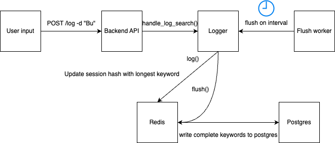

# Search Logger Challenge

## Problem Statement

As users search for experts or topics on the site, each keystroke triggers a search request. These queries must be **logged to a database**, but **only the most complete version** of each search string should be stored per session. For example, if a user types:

```
"B", "Bu", "Bus", "Busi", "Busin", "Busine", "Busines"
```

Then only `Busines` should be persisted.

### Requirements:

* Store the deduplicated search in a **PostgreSQL** or **MySQL** database.
* Handle **both logged-in users and anonymous users**.
* Work in a **multi-server environment**.
* Logging is triggered asynchronously from an API endpoint.
* Code must be **production-ready**, concurrency-safe, and efficient.

---

## Assumptions & Design Constraints

* The FastAPI server is **stateless** and may run across multiple containers or servers.
* **Redis** is used as a centralized, ephemeral cache shared between all instances.
* Every user (anonymous or logged in) is identified by a `session_id`. Logged-in users also send a `user_id`.
* The frontend **sends every keystroke**, not just debounced terms. Backend must deduplicate.
* A **flush worker** asynchronously persists deduplicated results to the database.
* Redis keys are set with short TTLs (10s) to avoid stale data accumulation.
* PostgreSQL is used for persistence; asyncpg provides efficient connection pooling.

---

## Design Overview

The system separates the responsibilities of **handling incoming search events** from **writing to the database**, using Redis as a deduplication buffer.

### Flow Summary:

1. `/log` API receives search input and launches `logger.log(...)` asynchronously.
2. `Logger.log(...)` stores the longest keyword seen for a `session_id` (and optional `user_id`) in Redis.
3. A background process (`flush_worker.py`) periodically reads Redis and calls `logger.flush()`.
4. Each Redis entry includes a timestamp. During flushing, the system checks how long each entry has existed in Redis.
5. Only entries that have **existed longer than the debounce window** (e.g. 5 seconds) are considered complete and flushed to the database.
6. Redis keys are deleted after flush to prevent reprocessing.

### Key Insight:

Rather than flushing blindly on a fixed interval, this system lets each search term **"age" just long enough** to ensure that the user has finished typing. This avoids premature logging of incomplete keywords while still keeping latency low and throughput high.

This ensures the logging logic is:

* **Debounced**: only the most complete search string is flushed.
* **Idempotent**: multiple keystrokes won’t cause multiple writes.
* **Multi-server-safe**: Redis acts as the central point of coordination.



---

## Component Breakdown

### 1. `app.py` (FastAPI Server)

* Exposes a `/log` endpoint that accepts `keyword`, `session_id`, and optional `user_id`.
* Calls `logger.log(...)` using `asyncio.create_task()` to avoid blocking the request.

### 2. `logger.py`

* Core class for debounced search logging.
* Stores keyword, timestamp, and optional `user_id` in Redis using the `session_id` as a key.
* `flush()` reads all valid Redis entries, checks timestamp buffer, and inserts deduplicated data into Postgres.

### 3. `flush_worker.py`

* Periodic background task runner.
* Calls `logger.flush()` in a loop every second.
* Ensures deduplicated search logs are flushed in a timely manner.

### 4. `start.sh`

* Entrypoint script that starts FastAPI in the background and keeps the container alive by running the flush worker in the foreground.

### 5. `Dockerfile`

* Containerizes the application.
* Uses a lightweight `python:3.11-slim` base image.
* Installs all dependencies and launches the full system via `start.sh`.

### 6. `test_logger.py`

* Unit tests for the `Logger` class.
* Covers deduplication logic, timestamp handling, and edge cases like missing or malformed Redis values.

### 7. `test-harness/test_runner.sh`

* Bash script for simulating keystroke-based search input.
* Sends partial terms to the API and waits for flush confirmation.
* Verifies that only the final (longest) version of each term is written to Postgres.
* Simulates search sequences and verifies final inserts in Postgres.

---

## Summary

This implementation meets all challenge goals:

* Works in concurrent, multi-server setups
* Handles anonymous and logged-in users
* Debounces noisy keystroke streams
* Efficiently flushes clean logs to SQL
* Is production-ready and testable

Future improvements could include:

* Support for batch inserts to reduce database overhead by writing multiple logs in a single SQL statement, improving performance at scale.
* TTL tuning based on observed behavior
* Monitoring flush stats for observability

---

## How to Run

### Prerequisites

* [Docker](https://www.docker.com/) and [Docker Compose](https://docs.docker.com/compose/install/) installed
* [pyenv](https://github.com/pyenv/pyenv) installed for managing Python version (3.11+)

### Run with Docker Compose

Start the full application stack including FastAPI, Redis, and Postgres:

```bash
docker-compose up --build
```

This runs:

* FastAPI on `localhost:8000`
* Redis on the default port
* Postgres with the `search_logs` database
* `flush_worker.py` for periodic database writes

### Run Tests Locally

To run the unit tests without Docker:

```bash
pyenv install 3.11.6  # if needed
pyenv local 3.11.6
python -m venv venv && source venv/bin/activate
pip install -r requirements.txt
pytest
```

### Run the Test Harness

The test harness is located in the `test-harness/` directory. It simulates real-time user input by sending progressive search terms to the `/log` endpoint, then verifies what was flushed to Postgres after a debounce interval.

```bash
bash test-harness/test_runner.sh
```

Make sure Redis and Postgres are running (e.g., via `docker-compose up`) before executing the script. This test exercises the full logging and flush pipeline end-to-end.

Make sure Redis and Postgres are running (e.g., via `docker-compose up`) before executing the script. This test exercises the full logging and flush pipeline end-to-end.

This will simulate real search input and verify the expected behavior in Postgres.

---
